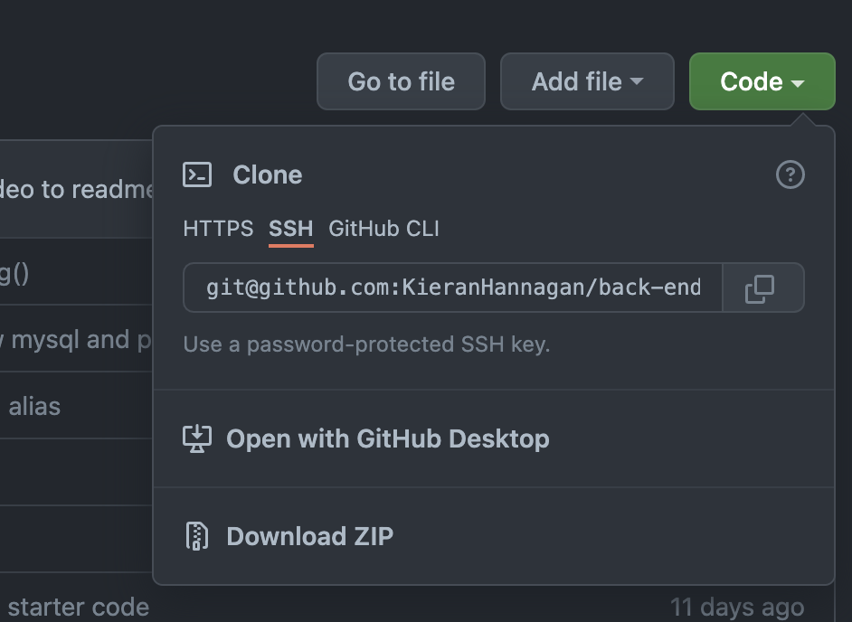
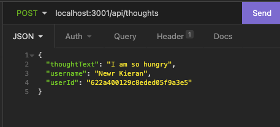

# be-social
          
  ## Description
This is a CRUD application aimed at social users, it allows people to connect and share thoughts to one another, as well as reactions to those thoughts. This repository is only the backend, there is no deployed application so if you would like to use it you will have to clone this repo (see [Installation](#installation)). This is a Node.js application that uses express for servers, MongoDB for the database and mongoose as the ODM (refer to usage for `package.json`). 

There are two models you can preform a query on, Users and Thoughts. You can create users, update them and delete them. You can add other users as your friends and delete them if you feel they deserve it. You can also post thoughts, which will be linked to your User account, you can delete the thoughts as well. Finally, you can react to other peoples thoughts and delete you reactions.
  
  * [Installation](#installation)
  * [Usage](#usage)
  * [Test](#tests)
  * [Questions](#questions)
  * [GitHub](#github)
  * [Email](#email)
  
  ## Installation 

  Clone the repo in your terminal using shell and navigate to your newly cloned directory. You will then want to open the file in your preferred coding software.
        

  ### MongoDB
  You will need to have MongoDB installed and have access to run the program from anywhere. It will need to have an instance running in the background. 

You can either have it running locally or via Heroku.
  ## Usage 
This application uses Node.js dependencies, here is the list of packages that should come ready in your `package.json` :

            "dependencies": {
        "express": "^4.17.2",
        "mongoose": "^5.9.7",
        }

To initialize the application and insure that these packages are running locally, run `npm install` from your terminal in the root of the application. Then, you can start your server with `npm start` and start accessing the endpoints. 
List of localhost endpoints:

* `api/users`
* `api/users/:id`
* `api/users/:id/friends/:friendId`
* `api/thoughts`
* `api/thought/:id`
* `api/thought/:id/reactions`
* `api/thought/:id/reactions/:reactionId`

Watch the [video](https://drive.google.com/file/d/1xiTvgLaC7fIOWh8-fuUTRieRrIVMoYm2/view) below for reference:

  ## Tests 
  Watch the video above for live testing examples using [Insomnia](https://insomnia.rest/download).

  ## Questions
  If you have any questions, feel free to reach out and contact me via email.
  ### Email
  kieranhan1999@gmail.com
  ### GitHub
  www.github.com/KieranHannagan
  

  